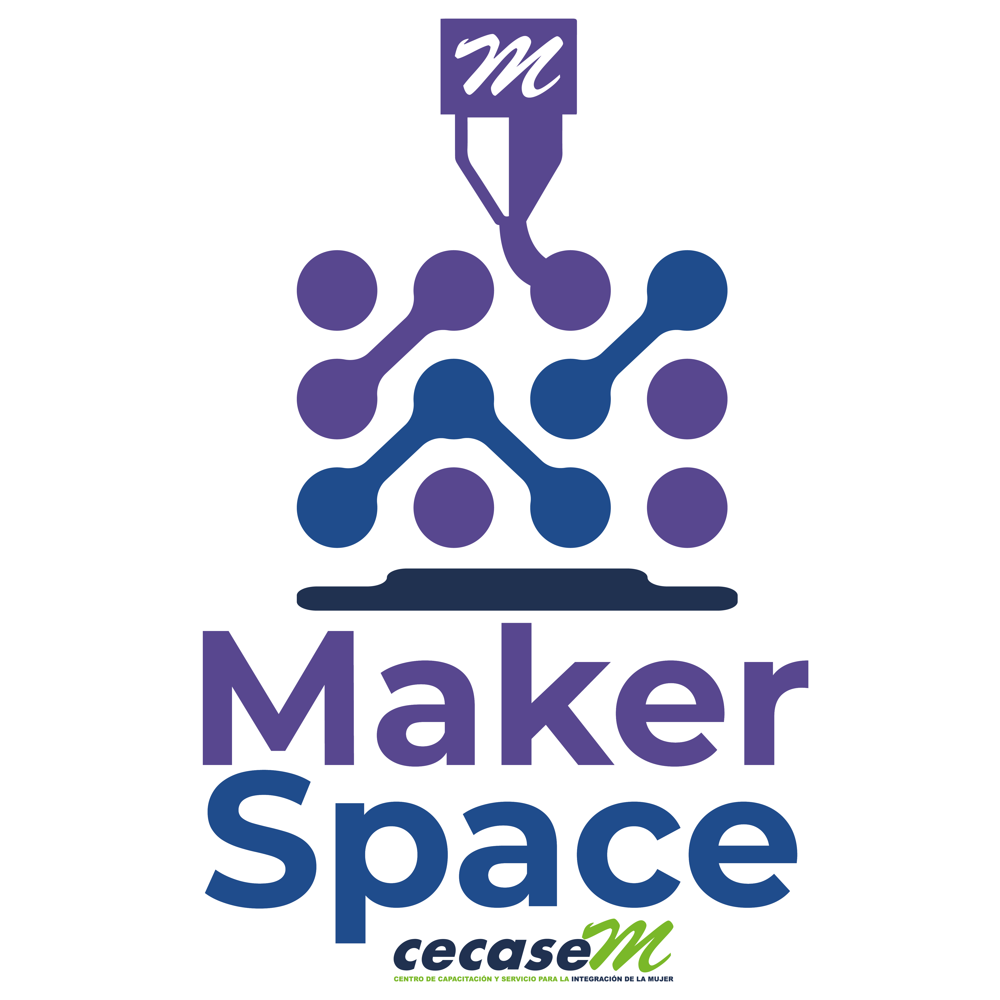

# 🌱 Makerspace San Ignacio de Velasco

  

Bienvenido al repositorio oficial del **Makerspace de San Ignacio de Velasco**.  
Este espacio colaborativo impulsa la **innovación comunitaria**, la **fabricación digital** y el **aprendizaje práctico**, conectando a jóvenes, docentes, facilitadores y comunidades rurales para crear soluciones locales a partir de la creatividad y la tecnología.  

## 🚀 Objetivos
- Fomentar la cultura **maker** en San Ignacio de Velasco.  
- Promover la **innovación comunitaria** para resolver necesidades locales.  
- Desarrollar habilidades en **fabricación digital, electrónica, IoT y sostenibilidad**.  
- Generar proyectos replicables en otras comunidades.  

## 🛠️ Áreas de trabajo
- **Fabricación digital**: impresión 3D, corte láser y reutilización de materiales.  
- **Electrónica e IoT**: sensores, microcontroladores y soluciones digitales.  
- **Proyectos comunitarios**: filtros de agua, sistemas de riego, trampas para plagas, composteras, etc.  
- **Formación y talleres**: capacitaciones, manuales y actividades para embajadores y facilitadores.  

## 🌍 Comunidades participantes
El Makerspace trabaja con distintas comunidades de San Ignacio de Velasco y sus alrededores:  
- **Suponema**  
- **Sañonama**  
- **Sutuniquiña**  
- **San Antonio del Cerro**  

Cada comunidad desarrolla proyectos de innovación adaptados a sus necesidades y recursos.  

## 📂 Contenido del repositorio
- `/proyectos/` → Documentación, planos y manuales de cada proyecto comunitario.  
- `/talleres/` → Materiales de capacitación y guías de formación.  
- `/codigo/` → Programas, ejemplos y librerías usadas en proyectos de electrónica e IoT.  
- `/documentacion/` → Informes, presentaciones y recursos de apoyo.  

